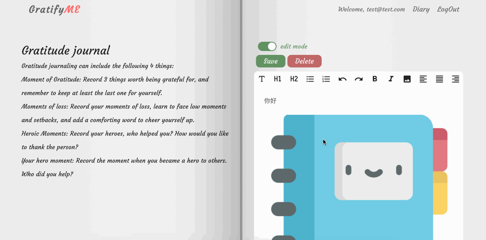
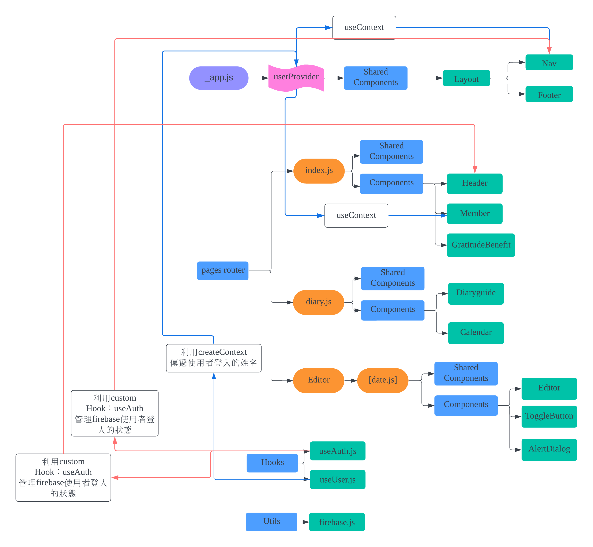

## About GratifyME

A website that allows users to easily record a gratitude diary to improve users' happiness and life satisfaction.

## Demo

https://gratifyme.vercel.app/

If you do not use a Google account to log in, you can use the following test account and password.

account:test@test.com

password:test012

### Use features

Switching between editing mode and reading mode.

## Tech Stack

This project uses next.js.react as my front-end framework, and uses react-big-calendar and lexical to complete the overall diary function. The database uses firebase services, including Firebase Authentication, Firebase FireStore, and Firebase Storage, and is finally deployed to vercel.

## Component Tree

I use next.js pages router because it has several benefits.

- File-system Based Routing
- Dynamic Routing
- Static Generation and Server-side Rendering
- Enhanced SEO
- Easy to Customize

## Contact

Name:陳玟穎 Wen Ying Chen

Email:leftleft0813@gmail.com
